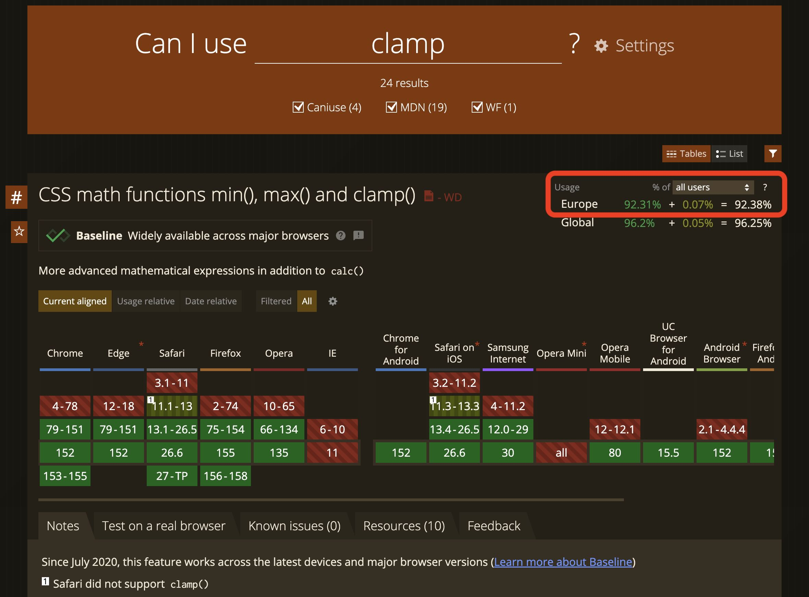

Everything we build for the web must work in these browsers:

- Chrome and other Chromium based (Edge, Opera, ...)
- Firefox and other Gecko based
- Safari for macOS and iOS

## Modern Features

Check support with [CanIUse.com](https://caniuse.com).

Relevant value: **`All Users/Europe`**

### Frontend/Site

Anything with a usage share of **>= 93%** can be used freely.

Anything with a usage share of **>= 90%** can be used if the basic functionality still works. This means: The site must still work if this feature is not supported, but styling may
slightly differ or behavior may not feel perfect. Depending on the feature or deviation in behavior, this threshold may be lower. The final decision lies with the responsible stylist.

### Admin

Everything supported by the current version of the browsers above can be used.

:::note
HTML emails are not browsers. Email clients have their own, much smaller feature set — see [Building HTML Emails](../3-features-modules/13-building-html-emails/1-email-basics.md).
:::
